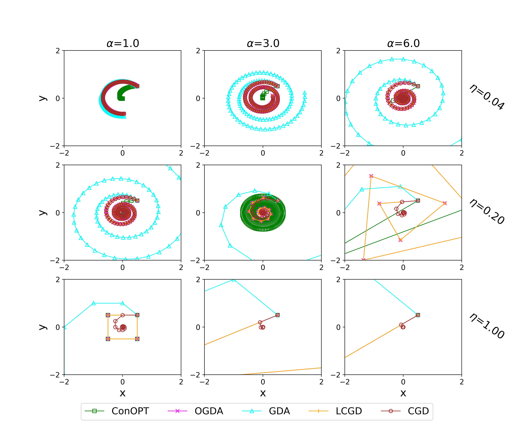
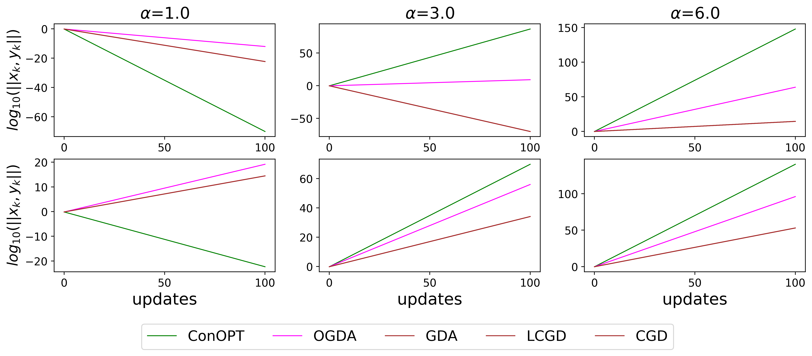
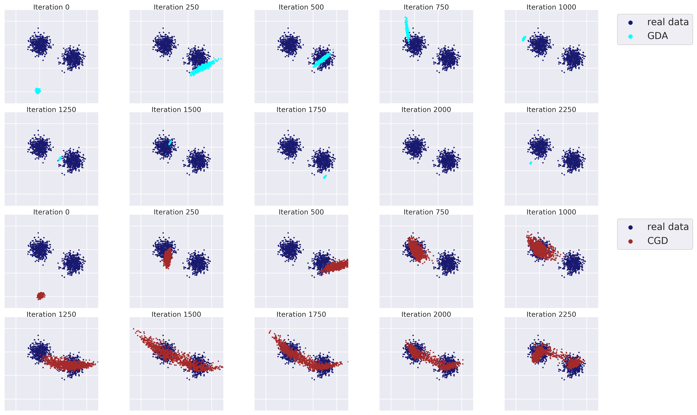

# competitive_gradient_descent
A pytorch implementation of [Competitive Gradient Descent](https://arxiv.org/abs/1905.12103) (CGD). Also check the [original implementation](https://github.com/f-t-s/CGD) in Julia.

#### Requirements

Note that the versions are just the ones we used and are not necessarily hard requirements:
```
torch==1.3.1
torchvision==0.4.2
jupyter==1.0.0
tqdm==4.36.1
numpy==1.17.2
matplotlib==3.1.1
Pillow==6.2.1
imageio==2.6.1
```

## CGD on scalar games

In this first set of experiment reproduction, we use a very easy to read, scalar version of CGD for more clarity. The code for these experiments can be found in [exp1_scalar_games](exp1_scalar_games/scalar_games.ipynb).





## CGD for training a GAN to fit a 2D gaussian mixture

In this second set of experiment reproduction, we use scaled-up implementation of the algorithm that uses Conjugate Gradient to approximately solve for CGD's update at each learning iteration as described in the original paper. The code for these experiments can be found in [exp2_gaussian_mixture](exp2_gaussian_mixture/CGD_vs_GDA_GaussianMixture_GAN.ipynb).




## CGD for training a GAN for image generation on MNIST

Finally we extend the experiments presented in the original paper by applying CGD to the more challenging task of image generation. The code for these experiments can be found in [exp3_image_generation](exp3_image_generation).
